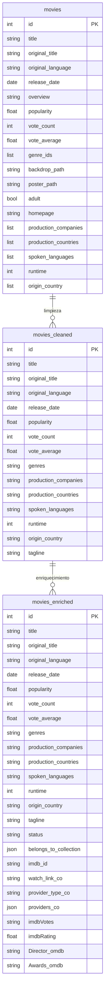

## Estructura de Tablas

El siguiente diagrama muestra las principales tablas del proyecto y sus relaciones:

```mermaid
erDiagram
    movies {
        int id PK
        string title
        string original_title
        string original_language
        date release_date
        string overview
        float popularity
        int vote_count
        float vote_average
        list genre_ids
        string backdrop_path
        string poster_path
        bool adult
        string homepage
        list production_companies
        list production_countries
        list spoken_languages
        int runtime
        list origin_country
    }
    
    movies_cleaned {
        int id PK
        string title
        string original_title
        string original_language
        date release_date
        float popularity
        int vote_count
        float vote_average
        string genres
        string production_companies
        string production_countries
        string spoken_languages
        int runtime
        string origin_country
        string tagline
    }
    
    movies_enriched {
        int id PK
        string title
        string original_title
        string original_language
        date release_date
        float popularity
        int vote_count
        float vote_average
        string genres
        string production_companies
        string production_countries
        string spoken_languages
        int runtime
        string origin_country
        string tagline
        string status
        json belongs_to_collection
        string imdb_id
        string watch_link_co
        string provider_type_co
        json providers_co
        string imdbVotes
        float imdbRating
        string Director_omdb
        string Awards_omdb
    }
    
    movies ||--o{ movies_cleaned : "limpieza"
    movies_cleaned ||--o{ movies_enriched : "enriquecimiento"

```