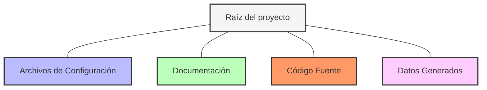
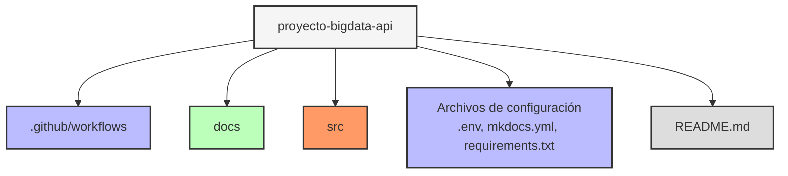
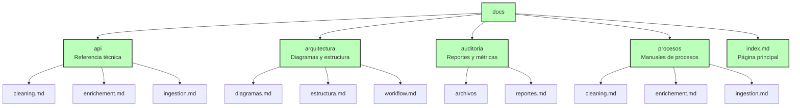
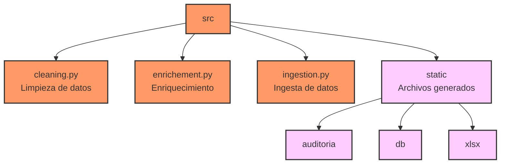

## Guía de Colores

```mermaid
graph TB
    A[Raíz del proyecto] --- B[Archivos de Configuración]
    A --- C[Documentación]
    A --- D[Código Fuente]
    A --- E[Datos Generados]
    
    style A fill:#f5f5f5,stroke:#333,stroke-width:2px
    style B fill:#bbf,stroke:#333,stroke-width:2px
    style C fill:#bfb,stroke:#333,stroke-width:2px
    style D fill:#f96,stroke:#333,stroke-width:2px
    style E fill:#fcf,stroke:#333,stroke-width:2px
```

## Estructura Principal del Proyecto

```mermaid
graph TB
    A[proyecto-bigdata-api] --> B[.github/workflows]
    A --> C[docs]
    A --> D[src]
    A --> E[Archivos de configuración<br>.env, mkdocs.yml, requirements.txt]
    A --> F[README.md]
    
    style A fill:#f5f5f5,stroke:#333,stroke-width:2px
    style B fill:#bbf,stroke:#333,stroke-width:2px
    style C fill:#bfb,stroke:#333,stroke-width:2px
    style D fill:#f96,stroke:#333,stroke-width:2px
    style E fill:#bbf,stroke:#333,stroke-width:2px
    style F fill:#ddd,stroke:#333,stroke-width:2px
```

## Estructura de Documentación

```mermaid
graph TB
    C[docs] --> C1[api<br>Referencia técnica]
    C --> C2[arquitectura<br>Diagramas y estructura]
    C --> C3[auditoria<br>Reportes y métricas]
    C --> C4[procesos<br>Manuales de procesos]
    C --> C5[index.md<br>Página principal]
    
    C1 --> C1A[cleaning.md]
    C1 --> C1B[enrichement.md]
    C1 --> C1C[ingestion.md]
    
    C2 --> C2A[diagramas.md]
    C2 --> C2B[estructura.md]
    C2 --> C2C[workflow.md]
    
    C3 --> C3A[archivos]
    C3 --> C3B[reportes.md]
    
    C4 --> C4A[cleaning.md]
    C4 --> C4B[enrichement.md]
    C4 --> C4C[ingestion.md]
    
    style C fill:#bfb,stroke:#333,stroke-width:2px
    style C1 fill:#bfb,stroke:#333,stroke-width:2px
    style C2 fill:#bfb,stroke:#333,stroke-width:2px
    style C3 fill:#bfb,stroke:#333,stroke-width:2px
    style C4 fill:#bfb,stroke:#333,stroke-width:2px
    style C5 fill:#bfb,stroke:#333,stroke-width:2px
```

## Estructura de Código Fuente

```mermaid
graph TB
    D[src] --> D2[cleaning.py<br>Limpieza de datos]
    D --> D3[enrichement.py<br>Enriquecimiento]
    D --> D4[ingestion.py<br>Ingesta de datos]
    D --> D1[static<br>Archivos generados]
    
    D1 --> D1A[auditoria]
    D1 --> D1B[db]
    D1 --> D1C[xlsx]
    
    style D fill:#f96,stroke:#333,stroke-width:2px
    style D2 fill:#f96,stroke:#333,stroke-width:2px
    style D3 fill:#f96,stroke:#333,stroke-width:2px
    style D4 fill:#f96,stroke:#333,stroke-width:2px
    style D1 fill:#fcf,stroke:#333,stroke-width:2px
    style D1A fill:#fcf,stroke:#333,stroke-width:2px
    style D1B fill:#fcf,stroke:#333,stroke-width:2px
    style D1C fill:#fcf,stroke:#333,stroke-width:2px
```

