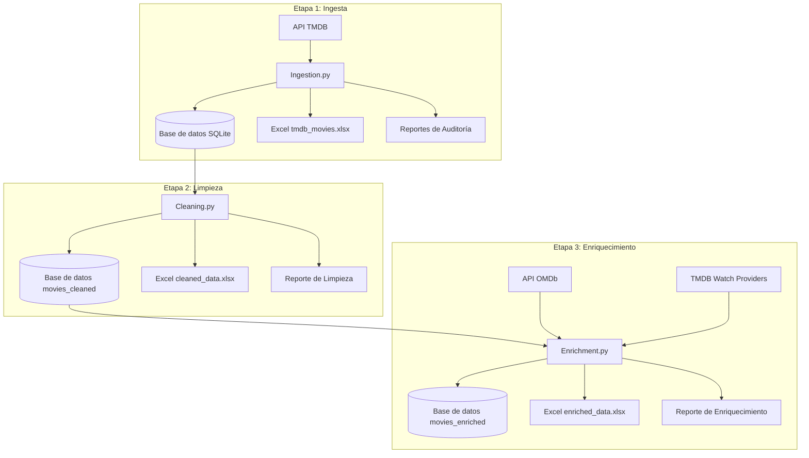

# Diagramas del Proyecto

## Flujo de Trabajo ETL

El siguiente diagrama muestra el flujo completo del proceso ETL implementado en este proyecto:

```mermaid
flowchart TD
    A[API TMDB] --> B[Ingestion.py]
    B --> C[(Base de datos SQLite)]
    B --> D[Excel tmdb_movies.xlsx]
    B --> E[Reportes de Auditoría]
    
    C --> F[Cleaning.py]
    F --> G[(Base de datos movies_cleaned)]
    F --> H[Excel cleaned_data.xlsx]
    F --> I[Reporte de Limpieza]
    
    G --> J[Enrichment.py]
    K[API OMDb] --> J
    L[TMDB Watch Providers] --> J
    J --> M[(Base de datos movies_enriched)]
    J --> N[Excel enriched_data.xlsx]
    J --> O[Reporte de Enriquecimiento]
    
    subgraph "Etapa 1: Ingesta"
        A
        B
        C
        D
        E
    end
    
    subgraph "Etapa 2: Limpieza"
        F
        G
        H
        I
    end
    
    subgraph "Etapa 3: Enriquecimiento"
        J
        K
        L
        M
        N
        O
    end
```